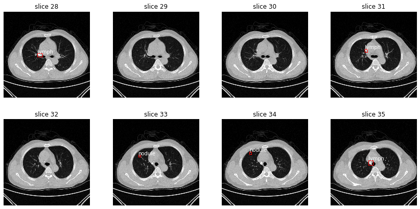

# 阿里云天池大赛——肺部CT多病种智能诊断

本仓库为 [阿里云天池大赛-肺部CT多病种智能诊断](https://tianchi.aliyun.com/competition/entrance/231724/introduction) 的参赛代码。

## 数据集

- 输入：N 个患者的 3D CT 扫描图片，每个 3D 扫描图片包含一定数量的 2D 切片。
- 标签：包含四种病灶，标注了所有病灶的中心位置和 3D 长宽高。
- 目标：自动标注测试集中的病灶中心位置，只要该位置位于实际病灶的 3D 立方体内部，即认为标注正确。

## 模型

模型采用了 [Mask_RCNN](https://github.com/matterport/Mask_RCNN)。

但由于我们不需要识别 mask，所以将 mask 的相关逻辑删除了，见 [修改后的 Mask_RCNN](https://github.com/Henry-Mike/Mask_RCNN)。

修改之后相当于 Faster-RCNN，但在 ROI 部分使用的是 ROI-Align，而非 ROI-Pooling。一般来说，ROI-Align 的效果更好。

[下载预训练权重](https://pan.baidu.com/s/1qy-WVJgeRqqrlhn4YRMxlw)，提取码 `fjf7`。

## 效果

2D 识别效果：

文件 `result.csv` 为预赛最终提交结果，总排名 71/1635。

## 改进方向

目前的模型仍然是基于对 2D 图像的检测，最终使用一种启发式的方法将得到的 2D 标注连接成为 3D 标注。

如果将 Mask-RCNN 模型改造成接受 3D 图像，预计效果会有很大提升。

## 参考资料

- [天池医疗AI大赛[第一季]：肺部结节智能诊断](https://tianchi.aliyun.com/competition/entrance/231601/forum)
- [Kaggle Data Science Bowl 2017: Can you improve lung cancer detection?](https://www.kaggle.com/c/data-science-bowl-2017/kernels)
- [LUNA16 Grand Challenge](https://luna16.grand-challenge.org/)
- [天池医疗AI大赛肺部结节智能诊断在线分享](https://tianchi.aliyun.com/course/video?liveId=3387)
- [全球数据智能大赛(2019)——“数字人体”赛场 赛题解析](https://tianchi.aliyun.com/course/video?liveId=41063)
- [常见医疗扫描图像处理步骤](http://shartoo.github.io/medical_image_process/?nsukey=VpaPuYpq7%2F5ZAy2lqhHd1y6WELCCHh3QbpxYlOMIGIB41yQjjnhbnhIsJvN1lyVzhDzRGY8VGDa5Qdu3yW33el5FF8QGKARs4FJmzR0LOvyzeOv9n9nVpB1G%2ByxGCxZJfEu8D13yq5jC4DXczoLPQkqYmSZylFkk5XEHCMwIBoA%3D)
- [DICOM中窗宽窗位含义](https://blog.csdn.net/chenhuakang/article/details/79164134)
